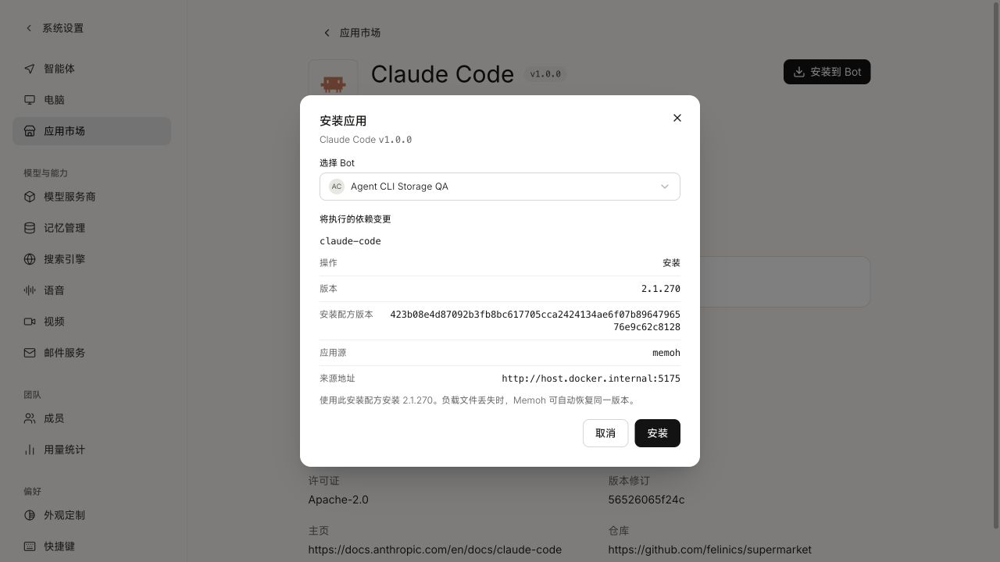
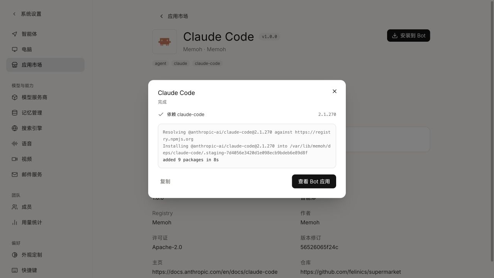

# Agent dependency storage verification

Verified on 2026-09-14 with Bun 1.3.14. Human QA has not been performed.

The local registry at `http://localhost:5175` served all 32 immutable dependency artifacts. Their digests matched the reviewed sources and dependency lock. The Memoh development Server consumed this registry at `http://host.docker.internal:5175`; its actual Web UI at `http://localhost:18082` installed Codex 0.154.0 and Claude Code 2.1.270 into a disposable Bot on a Linux ARM64/containerd workspace.

The confirmation below shows the exact Claude Code release, immutable recipe revision, local registry source and permission to restore that same release after payload loss. The completion screenshot shows the actual successful App operation, including npm output; it is not a mockup.

The recipe suite passed 185 Bun tests and 16 Python tests, plus registry validation, ShellCheck, type checking and the production build. The real-download smoke ran on Darwin ARM64: Node 24.4.1, uv 0.11.8, Python 3.13.2, Codex 0.154.0, Claude Code 2.1.270 and pnpm 12.4.1 were each installed and executed twice, deleting only the disposable local payload store between generations while retaining the persistent homes. All 12 installation/probe runs succeeded. This smoke does not claim an authenticated model turn or E2B performance result.

The coordinated Memoh change separately owns real rootfs deletion, desired-installation authorization, background repair, process leases and lifecycle cleanup. See the linked Memoh PR for its current integration results and remaining acceptance work.
